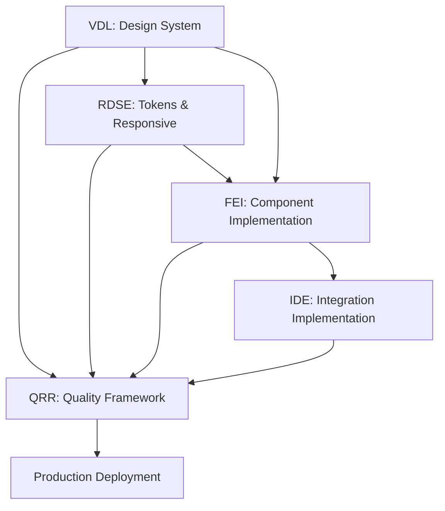

# Build Phase Handoff Documentation Template

This template standardizes handoff requirements and deliverables between Build Phase agents to ensure seamless coordination and prevent information gaps.

## Cross-Agent Handoff Matrix

### Visual Design Lead (VDL) → Other Agents

#### To Responsive & Design System Engineer (RDSE):
**Deliverables:**
- Design token specifications with exact values and usage contexts
- Component responsive behavior requirements with breakpoint specifications
- Spacing rhythm requirements for different viewport sizes
- Typography scaling requirements across device categories
- Visual interaction states that must be maintained across breakpoints

**Handoff Format:**
```yaml
design_tokens_handoff:
  colors:
    primary: "#3b82f6"
    secondary: "#6b7280"
    accent: "#f59e0b"
  typography:
    scale_ratio: 1.2
    base_size: "16px"
    line_height: 1.5
  spacing:
    base_unit: "4px"
    scale: [4, 8, 12, 16, 24, 32, 48, 64, 96]
  responsive_requirements:
    mobile_breakpoint: "320px-640px"
    tablet_breakpoint: "640px-1024px"
    desktop_breakpoint: "1024px+"
```

#### To Frontend Implementer (FEI):
**Deliverables:**
- Component visual state specifications with interaction details
- Accessibility requirements for color, contrast, and visual indicators
- Image optimization requirements and responsive behavior specifications
- Form element styling requirements with error/success state details
- Motion specifications with timing, easing, and reduced-motion handling

**Handoff Format:**
```markdown
## Component: LP/Hero/CTA-Primary

### Visual States Required:
- **Default:** Background #3b82f6, text #ffffff, border-radius 0.375rem
- **Hover:** Background #2563eb, transform translateY(-1px), transition 150ms ease-out
- **Focus:** Ring 2px offset 2px, color #3b82f6
- **Active:** Background #1d4ed8, transform translateY(0)
- **Disabled:** Background #9ca3af, cursor not-allowed, opacity 0.6

### Accessibility Requirements:
- Minimum contrast ratio 4.5:1 (validated: 7.2:1)
- Focus ring visible for keyboard navigation
- Screen reader text: "Get started with premium plan"
- Touch target minimum 44px (current: 48px height)
```

#### To Quality, Release & Reliability (QRR):
**Deliverables:**
- Visual regression test baseline establishment with screenshot specifications
- Cross-browser compatibility requirements and testing priorities
- Performance budget implications of visual elements (fonts, images, animations)
- Accessibility testing requirements for visual elements and interactions

### Responsive & Design System Engineer (RDSE) → Other Agents

#### To Visual Design Lead (VDL):
**Deliverables:**
- Design token implementation status and compliance reporting
- Component visual state verification across all responsive breakpoints
- Spacing and typography scale implementation validation
- Container query behavior documentation for design review

#### To Frontend Implementer (FEI):
**Deliverables:**
- Component prop interfaces with responsive behavior specifications
- Design token usage guidelines and implementation examples
- Responsive behavior expectations for accessibility and interaction
- Performance budgets and optimization requirements for responsive features

**Handoff Format:**
```typescript
// Component responsive behavior specification
interface ResponsiveButtonProps {
  size?: 'sm' | 'md' | 'lg' | 'xl';
  fullWidthOnMobile?: boolean;
  containerQuery?: {
    minWidth: string;
    behavior: 'stack' | 'inline' | 'grid';
  };
}

// Container query implementation requirement
.button-container {
  container: button / inline-size;
}

@container button (max-width: 300px) {
  .button {
    width: 100%;
    font-size: var(--font-size-sm);
  }
}
```

#### To Quality, Release & Reliability (QRR):
**Deliverables:**
- CLS measurement requirements and target thresholds
- Cross-device testing matrix with specific viewport and device targets
- Performance budget validation for responsive assets and queries
- Visual regression testing requirements for responsive breakpoints

### Frontend Implementer (FEI) → Other Agents

#### To Visual Design Lead (VDL):
**Deliverables:**
- Component implementation status with visual accuracy verification
- Interactive state implementations (hover, focus, active, disabled)
- Typography and spacing implementation against design system tokens
- Cross-browser rendering validation and any visual discrepancies

#### To Responsive & Design System Engineer (RDSE):
**Deliverables:**
- Component responsive behavior implementation status
- Design token integration and usage within components
- Container query implementations and breakpoint behavior
- Storybook story creation with component state demonstrations

#### To Integrations & Data Engineer (IDE):
**Deliverables:**
- Analytics data attributes and event tracking implementation
- Form integration points and validation requirements
- API integration hooks and error handling implementations
- Third-party service integration points and fallback strategies

**Handoff Format:**
```typescript
// Analytics integration points
interface AnalyticsButtonProps {
  eventName?: string;
  eventParams?: {
    source_section: string;
    cta_id: string;
    position?: string;
  };
  'data-testid'?: string;
}

// Form integration hooks
interface ContactFormState {
  onSubmit: (data: FormData) => Promise<void>;
  onValidationError: (errors: ValidationErrors) => void;
  onIntegrationError: (error: IntegrationError) => void;
}
```

#### To Quality, Release & Reliability (QRR):
**Deliverables:**
- Test coverage reports and component testing requirements
- Accessibility testing results and WCAG compliance verification
- Performance optimization results and bundle size impact
- Error boundary testing and graceful degradation validation

### Integrations & Data Engineer (IDE) → Other Agents

#### To Frontend Implementer (FEI):
**Deliverables:**
- API integration specifications with error handling requirements
- Analytics event tracking requirements with data attribute specifications
- Form submission handling with validation and integration error scenarios
- Payment processing UI flow and user experience requirements

**Handoff Format:**
```typescript
// Payment integration interface
interface PaymentFormProps {
  onPaymentIntent: (clientSecret: string) => void;
  onPaymentSuccess: (paymentIntent: PaymentIntent) => void;
  onPaymentError: (error: PaymentError) => void;
  loadingState: boolean;
}

// Analytics tracking requirements
interface TrackingRequirements {
  events: {
    cta_click: { source_section: string; cta_id: string };
    form_submit: { form_type: string; form_id: string };
    purchase: { transaction_id: string; value: number; currency: string };
  };
  consent_required: boolean;
  test_mode_exclusion: boolean;
}
```

#### To Quality, Release & Reliability (QRR):
**Deliverables:**
- Integration testing requirements with comprehensive failure scenario coverage
- Monitoring and alerting setup for all third-party service dependencies
- Performance testing for integration endpoints under load conditions
- Security testing for payment processing and data handling compliance

### Quality, Release & Reliability (QRR) → Other Agents

#### To All Agents:
**Deliverables:**
- Quality standards and testing requirements for each specialization
- Performance budgets and optimization targets
- Security compliance requirements and validation procedures
- Production deployment requirements and operational standards

**Handoff Format:**
```yaml
quality_standards:
  visual_design:
    contrast_ratio_minimum: 4.5
    visual_deviation_threshold: 2.0  # percentage
    cross_browser_requirements: ["Chrome", "Safari", "Firefox", "Edge"]
  
  responsive_design:
    cls_threshold: 0.10
    viewport_test_range: "320px-2560px"
    performance_budget:
      css_max_size: "80KB gzipped"
  
  frontend_implementation:
    test_coverage_minimum: 80
    typescript_strict: true
    accessibility_compliance: "WCAG AA"
  
  integrations:
    api_response_time_max: "500ms"
    webhook_retry_attempts: 5
    error_rate_threshold: 1.0  # percentage
  
  deployment:
    core_web_vitals:
      lcp_max: 2500  # milliseconds
      inp_max: 200   # milliseconds
      cls_max: 0.10  # score
```

## Handoff Timing & Dependencies

### Sequential Handoffs
1. **VDL** completes art direction → **RDSE** implements responsive design tokens
2. **RDSE** establishes component library → **FEI** implements components
3. **FEI** creates components with hooks → **IDE** implements integrations
4. **All agents** complete implementation → **QRR** validates and deploys

### Parallel Work Streams
- **VDL** and **RDSE** can work simultaneously on design system establishment
- **FEI** and **IDE** can work in parallel once component interfaces are defined
- **QRR** can establish CI/CD pipeline while other agents are implementing

### Integration Points


## Communication Protocols

### Status Updates
**Format:** Daily async updates in shared channel
**Required Information:**
- Current task/deliverable in progress
- Blockers or dependencies waiting on other agents
- Expected completion timeline for current deliverable
- Any changes to requirements or scope discovered

### Blocking Issues
**Escalation Path:**
1. **Agent-to-Agent:** Direct communication for clarification
2. **Build Program Lead:** Mediation for conflicts or priority decisions
3. **Stakeholder:** Business decisions or scope changes

**Format for Blocking Issues:**
```markdown
**BLOCKER:** [Agent] blocked by [Dependency]

**Issue:** Specific description of what's blocking progress
**Impact:** How this affects timeline and other deliverables  
**Required:** What's needed to unblock (decision, deliverable, clarification)
**Timeline:** When resolution is needed to maintain schedule
**Escalation:** Who needs to be involved to resolve
```

### Change Requests
**Process:**
1. **Impact Assessment:** Requesting agent provides impact analysis
2. **Cross-Agent Review:** Affected agents assess implications
3. **Build Program Lead Decision:** Final approval/rejection with rationale
4. **Documentation Update:** Changes reflected in all relevant deliverables

## Quality Gates Integration

### Gate-Specific Handoffs

#### beauty_ok Gate (VDL Owner):
- **Inputs Required:** Hi-fi designs, brand guidelines, accessibility requirements
- **Outputs Provided:** Visual QA approval, redline corrections, design system compliance
- **Handoff to Next Gate:** RDSE receives approved visual implementation for responsive adaptation

#### responsive_ok Gate (RDSE Owner):
- **Inputs Required:** Approved visual design, component specifications, performance budgets
- **Outputs Provided:** Responsive behavior validation, design token implementation, Storybook documentation
- **Handoff to Next Gate:** FEI and IDE receive responsive framework for implementation

#### integrations_ok Gate (IDE Owner):
- **Inputs Required:** Component interfaces, API specifications, analytics requirements
- **Outputs Provided:** Integration reliability validation, error handling verification, security compliance
- **Handoff to Next Gate:** QRR receives integration specifications for testing and monitoring

#### quality_ok & release_ok Gates (QRR Owner):
- **Inputs Required:** All implementation deliverables, performance requirements, security standards
- **Outputs Provided:** Quality validation, deployment readiness, monitoring configuration
- **Final Handoff:** Production-ready system with operational documentation

## Success Metrics

### Handoff Effectiveness Metrics
- **Information Completeness:** % of handoffs completed without follow-up questions
- **Timeline Adherence:** % of deliverables completed within agreed timeframes
- **Quality Impact:** Number of issues discovered in later phases due to handoff gaps
- **Rework Reduction:** % reduction in rework due to clear specifications

### Quality Indicators
- **Cross-Reference Accuracy:** Consistency of component IDs and specifications across agents
- **Integration Success:** First-time success rate of component and integration implementations
- **Performance Achievement:** % of performance budgets met without optimization cycles
- **Deployment Success:** Success rate of production deployments without critical issues

Remember: Effective handoffs are the foundation of successful Build Phase execution. Clear specifications, timely communication, and comprehensive documentation ensure each agent can build confidently on the work of others while maintaining accountability for their specialized domain.