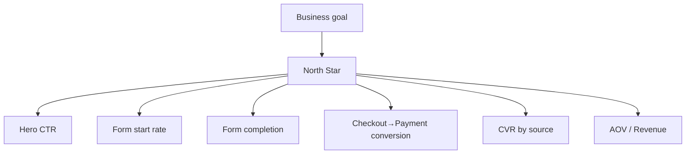

# KPI mini-tree — Template (quick-fill)

**Project / Version:**

**Owner:**

**Review cadence:** Daily ops / Weekly growth / Post-launch 30/60/90

## A) Business goal (why)

- One sentence: __

## B) North Star metric (what "win" looks like)

- **Name:** __
- **Exact definition:** __
- **Target & deadline:** __ by __
- **Guardrails (don't break):** CAC ≤ __, refund ≤ __%

## C) Funnel inputs (targets per step)

| Step | Metric | Definition | Formula | Target | Segment(s) | Owner | Cadence |
| --- | --- | --- | --- | --- | --- | --- | --- |
| 1. Traffic → LP | Qualified sessions | Sessions from target geo/device/source | filtered sessions | __ / week | utm_source, device | Growth | daily |
| 2. LP → Interest | **Hero CTR** | Primary CTA clicks ÷ LP sessions | clicks / sessions | **__%** | page / source | PMM | daily |
| 3. Interest → Form start | **Form start rate** | Form starts ÷ LP sessions | starts / sessions | **__%** | page / device | UX | daily |
| 4. Form start → Lead | **Form completion** | Submits ÷ Starts | submits / starts | **__%** | source / device | PMM | daily |
| 5. Lead → Checkout | Checkout start rate | Checkout starts ÷ LP sessions | ck_starts / sessions | __% | pricing_tier | Growth | daily |
| 6. Checkout → Purchase | **Payment conversion** | Purchases ÷ Checkout starts | purchases / ck_starts | **__%** | payment_method | Tech | daily |
| 7. Revenue quality | AOV | Revenue ÷ Purchases | rev / purchases | €__ | pricing_tier | Finance | weekly |
| 8. By source | **CVR by source** | Purchases ÷ Sessions (per source) | purchases / sessions | **__%** | utm_source | Growth | weekly |

## D) GA4 / GTM mapping (event → params)

- `view_section` → `{section_name, source_section, experiment_id?}`
- `cta_click` → `{section_name, cta_id, cta_label, destination, utm_*}`
- `lead_start` → `{form_location}`
- `lead_submit` → `{form_location, lead_id, validation_errors?}`
- `checkout_start` → `{pricing_tier, currency, utm_*}`
- `purchase_success` → `{value, currency, pricing_tier, payment_method}`

> Create GA4 custom definitions (scope=event) for all non-standard params (e.g., form_location, source_section, pricing_tier, payment_method, lead_id).
> 

## E) Acceptance checks (launch gate)

- North Star target + all step targets filled.
- Events firing in GA4 DebugView with parameters.
- Dashboard links listed (Explorations / Looker tile).

---

## Spreadsheet/table version (paste into Sheets)

| Layer | Metric | Definition | Formula | Unit | Direction | Segments | Baseline (date) | Target | Deadline | Owner | Data source | GA4 Event | GA4 Params | Reporting view | Cadence | Notes |
| --- | --- | --- | --- | --- | --- | --- | --- | --- | --- | --- | --- | --- | --- | --- | --- | --- |

> Keep "Direction" as ↑ or ↓ for quick conditional formatting.
> 

---

## Mermaid mini-tree (visual)



---

## JSON config (optional, for repos/dashboards)

```json
{
  "north_star": {
    "name": "",
    "definition": "",
    "target": {"value": 0, "by": "YYYY-MM-DD"},
    "guardrails": {"cac_eur_max": 0, "refund_rate_pct_max": 0}
  },
  "inputs": [
    {"name": "hero_ctr", "definition": "CTA clicks / LP sessions", "target_pct": 0, "event": "cta_click", "segments": ["page","utm_source"]},
    {"name": "form_start_rate", "definition": "lead_start / sessions", "target_pct": 0, "event": "lead_start", "params": ["form_location"]},
    {"name": "form_completion_rate", "definition": "lead_submit / lead_start", "target_pct": 0, "event": "lead_submit", "params": ["form_location"]},
    {"name": "payment_conversion_rate", "definition": "purchase_success / checkout_start", "target_pct": 0, "event": "purchase_success", "params": ["pricing_tier","payment_method"]},
    {"name": "cvr_by_source", "definition": "purchases / sessions by utm_source", "target_pct": 0}
  ]
}

```

---

# Example (filled — pt-PT)

**Projeto:** Café com Vendas — Lançamento de Setembro

**Owner:** Daniel (PMM)

**Revisão:** diária (ops) / semanal (growth)

## A) Objetivo de negócio

Vender **8 vagas** da mentoria e abrir canal de vendas previsível para próximas turmas.

## B) North Star

- **Matrículas qualificadas (pagas/validadas)**
- **Meta:** **8** até **20/09**
- **Guardrails:** CAC ≤ **€180** / vaga; reembolso ≤ **5%**

## C) Metas por etapa

| Etapa | Métrica | Definição | Fórmula | **Meta** | Segmentos | Owner | Cadência |
| --- | --- | --- | --- | --- | --- | --- | --- |
| 1. Tráfego → LP | Sessões qualificadas | Sessões PT/BR-PT de fontes alvo | sessões filtradas | **1.200/sem** | utm_source, device | Growth | diária |
| 2. LP → Interesse | **CTR do herói** | Cliques no CTA ÷ sessões | clicks/sessions | **≥ 4%** | página/fonte | PMM | diária |
| 3. Interesse → Start | **Início de formulário** | Starts ÷ sessões | starts/sessions | **≥ 25%** | página/device | UX | diária |
| 4. Start → Lead | **Conclusão do formulário** | Submissões ÷ starts | submits/starts | **≥ 55%** | fonte/device | PMM | diária |
| 5. Lead → Checkout | Início de checkout | ck_starts ÷ sessões | ck_starts/sessions | **≥ 15%** | pricing_tier | Growth | diária |
| 6. Checkout → Pagamento | **Conversão de pagamento** | compras ÷ ck_starts | purchases/ck_starts | **≥ 50%** | **payment_method** | Tech | diária |
| 7. Receita | AOV | receita ÷ compras | rev/purchases | **€1.200** | tier | Finance | semanal |
| 8. Por fonte | **CVR por fonte** | compras ÷ sessões por `utm_source` | purchases/sessions | **IG ≥ 2.5%** | utm_source | Growth | semanal |

## D) GA4 / GTM

- `cta_click{section_name:"hero", cta_id:"hero_primary", utm_*}`
- `lead_start{form_location:"modal_step1"}`
- `lead_submit{form_location:"modal_step1", lead_id}`
- `checkout_start{pricing_tier:"flagship", currency:"EUR", utm_*}`
- `purchase_success{value:1200, currency:"EUR", pricing_tier:"flagship", payment_method:"mb_way"}`
    
    **Custom definitions a criar:** `form_location`, `source_section`, `pricing_tier`, `payment_method`, `lead_id`.
    

## E) Aceitação (gate)

- Targets acima aprovados; eventos visíveis no **DebugView** com parâmetros corretos; painel em GA4 Exploration salvo.

---

### Handy formulas

- **Hero CTR** = CTA clicks / LP sessions
- **Form start rate** = lead_start / sessions
- **Form completion** = lead_submit / lead_start
- **Payment conversion** = purchase_success / checkout_start
- **CVR by source** = purchases / sessions (grouped by `utm_source`)
- **CAC** = ad_spend / purchases