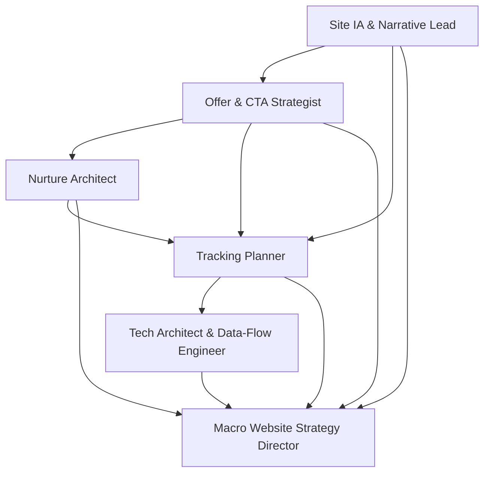

# Macro Website Strategy Phase Handoff Documentation

This document specifies the handoff requirements, data flows, and integration points between agents in the Macro Website Strategy phase.

## Handoff Overview

The Macro Website Strategy phase involves complex interdependencies between agents creating both content strategy (v1A) and measurement strategy (v1B). Proper handoffs ensure coherent integration between what pages promise and what systems can measure.

### Agent Dependencies Map



---

## Phase 1: Foundation Building (SIANL → Others)

### SIANL → OCS Handoff
**Timing**: After SIANL completes Pages Overview and Template Narratives

**Data Transmitted:**
```yaml
pages_structure:
  - page_types: ["home", "service", "case_detail", "about", "contact", "pricing"]
  - primary_cta_assignments: {"home": "get_consultation", "service": "request_quote"}
  - evidence_requirements: {"home": ["testimonials", "results"], "service": ["case_studies", "method"]}
  - avatar_emotional_focus: {"home": "aspiration_focused", "service": "credibility_focused"}

narrative_flow:
  - conversion_moments: ["hero", "after_proof", "final_conversion"]
  - supporting_actions: ["view_cases", "download_guide", "see_pricing"]
  - risk_reduction_needs: ["guarantee_messaging", "social_proof", "expertise_demonstration"]
```

**Handoff Validation:**
- [ ] Every page type has primary CTA assignment
- [ ] Avatar emotional states mapped to page sections
- [ ] Evidence requirements support value propositions
- [ ] Conversion moments identified for CTA placement

### SIANL → TP Handoff
**Timing**: After SIANL completes Pages Overview

**Data Transmitted:**
```yaml
page_taxonomy:
  - page_types: ["home", "service", "case_detail", "blog_post", "about", "contact", "pricing"]
  - content_hierarchy: {"service": ["hero", "method", "proof", "pricing"]}
  - user_journey_points: ["entry", "consideration", "conversion", "confirmation"]

tracking_requirements:
  - engagement_indicators: ["scroll_depth", "time_on_page", "section_views"]
  - content_consumption: ["case_study_read", "video_completion", "guide_download"]
  - navigation_patterns: ["page_sequence", "exit_points", "return_behavior"]
```

**Handoff Validation:**
- [ ] Page type taxonomy is trackable and implementable
- [ ] Content hierarchy supports engagement measurement
- [ ] User journey points can be measured with available events

---

## Phase 2: Strategy Integration (OCS/NA → TP)

### OCS → NA Handoff
**Timing**: After OCS completes Offer & CTA Mapping

**Data Transmitted:**
```yaml
offer_progression:
  - cold_stage_offers: ["guide_download", "newsletter_signup", "webinar_attendance"]
  - warm_stage_offers: ["consultation_booking", "audit_request", "demo_schedule"]
  - hot_stage_offers: ["quote_request", "package_selection", "contract_signing"]

cta_commitment_levels:
  - low_commitment: ["email_address"]
  - medium_commitment: ["scheduled_time", "phone_number"]
  - high_commitment: ["financial_investment", "contract_agreement"]

journey_progression:
  - temperature_indicators: {"cold_to_warm": "multiple_content_consumption", "warm_to_hot": "pricing_engagement"}
  - conversion_triggers: {"urgency": "limited_availability", "social": "peer_success"}
```

**Handoff Validation:**
- [ ] Offer commitment levels align with nurture sequence intensity
- [ ] Journey progression triggers are automatable
- [ ] CTA positioning supports nurture flow entry points

### OCS → TP Handoff  
**Timing**: After OCS completes CTA Strategy

**Data Transmitted:**
```yaml
cta_events_mapping:
  - primary_ctas:
      book_consultation: "consultation_booking"
      request_quote: "quote_request" 
      download_guide: "guide_download"
      get_started: "service_initiation"
  - secondary_ctas:
      view_cases: "case_study_view"
      see_pricing: "pricing_page_view"
      ask_question: "inquiry_submit"

measurement_requirements:
  - conversion_funnel: ["awareness", "consideration", "decision", "action"]
  - a_b_testing_needs: ["cta_copy", "button_color", "placement", "timing"]
  - optimization_metrics: ["click_through_rate", "conversion_rate", "page_abandonment"]
```

**Handoff Validation:**
- [ ] Every primary and secondary CTA has corresponding event
- [ ] Event names follow snake_case convention
- [ ] Measurement requirements are technically feasible
- [ ] A/B testing framework supports optimization needs

### NA → TP Handoff
**Timing**: After NA completes Nurture Flow Architecture

**Data Transmitted:**
```yaml
automation_triggers:
  - behavioral_triggers:
      email_engagement_low: "re_engagement_sequence"
      consultation_no_show: "follow_up_sequence"
      pricing_page_multiple_views: "sales_ready_sequence"
  - temporal_triggers:
      day_3_post_signup: "educational_content"
      day_14_no_purchase: "social_proof_sequence"
      month_1_customer: "expansion_introduction"

segmentation_requirements:
  - engagement_scoring: ["email_opens", "link_clicks", "content_consumption"]
  - journey_stage_indicators: ["lead_temperature", "purchase_readiness", "expansion_potential"]
  - exit_condition_tracking: ["unsubscribe", "purchase_success", "support_escalation"]

personalization_data:
  - content_preferences: ["blog_topics", "case_study_industries", "service_interests"]
  - behavioral_patterns: ["peak_engagement_times", "preferred_content_length", "device_usage"]
```

**Handoff Validation:**
- [ ] All automation triggers are measurable events
- [ ] Segmentation logic can be implemented with available data
- [ ] Exit conditions have corresponding tracking events
- [ ] Personalization requirements are privacy-compliant

---

## Phase 3: Technical Implementation (TP → TADE)

### TP → TADE Handoff
**Timing**: After TP completes Event & Parameter Dictionary

**Data Transmitted:**
```yaml
technical_specifications:
  - event_dictionary:
      consultation_booking:
        critical_params: ["consultation_type", "lead_id", "page_type"]
        destinations: ["ga4", "crm", "email_platform"]
        privacy_classification: "behavioral_no_pii"
  - parameter_constraints:
      lead_id: {"type": "string", "generate": "crypto.randomUUID()", "persist": "localStorage"}
      page_type: {"type": "enum", "values": ["home", "service", "case_study"], "required": true}

platform_requirements:
  - gtm_configuration: {"triggers": 15, "variables": 8, "tags": 12}
  - integration_endpoints:
      crm: {"api": "hubspot_v3", "auth": "api_key", "rate_limit": "100_per_10s"}
      email: {"api": "mailerlite_v2", "auth": "bearer_token", "webhooks": true}
  - data_destinations:
      ga4: {"events": "all", "custom_dimensions": 5, "conversion_goals": 8}
      crm: {"contact_creation": "lead_capture", "deal_creation": "consultation_booking"}

compliance_requirements:
  - privacy_policy: {"consent_categories": ["analytics", "marketing"], "retention": "2_years"}
  - data_governance: {"pii_exclusion": "enforced", "test_mode": "staging_automatic"}
```

**Handoff Validation:**
- [ ] All events have complete technical specifications
- [ ] Platform integration requirements are feasible
- [ ] Privacy and compliance requirements are implementable
- [ ] Performance requirements (page load impact) are acceptable

---

## Phase 4: Orchestrator Integration (All → MWSD)

### Cross-Agent Output Collection
**Timing**: After all subagents complete their core deliverables

**MWSD Collection Checklist:**
```yaml
sianl_outputs:
  - pages_overview: "complete_with_evidence_gaps_marked"
  - template_narratives: "all_sections_with_proof_requirements"
  
ocs_outputs:
  - offer_cta_mapping: "cold_warm_hot_coverage_complete"
  - page_type_defaults: "primary_cta_per_page_no_conflicts"
  
na_outputs:
  - no_pay_branch: "sequences_with_triggers_and_exits"
  - customer_branch: "onboarding_value_expansion_complete"
  
tp_outputs:
  - key_actions_events: "all_ctas_have_corresponding_events"
  - event_parameter_dictionary: "snake_case_no_pii_test_mode"
  
tade_outputs:
  - gtm_triggers: "implementation_ready_specifications"
  - technical_architecture: "complete_with_data_flow_diagrams"
```

### Cross-Linking Validation Process
**MWSD Responsibility**: Ensure coherence between v1A content strategy and v1B measurement strategy

**Validation Steps:**
1. **CTA → Event Cross-Reference**
   ```bash
   # Validate every primary CTA has corresponding event
   for cta in $(grep "primary_cta" v1a_output.md); do
     grep -q "$cta" v1b_events.md || echo "MISSING: $cta event not found"
   done
   ```

2. **Naming Consistency Check**
   ```bash
   # Ensure snake_case throughout
   grep -E '[A-Z]|[[:space:]]|-' all_outputs.md && echo "FAIL: Non-snake_case found" || echo "PASS"
   ```

3. **Identity Policy Validation**
   ```yaml
   identity_verification:
     lead_id_generation: "consistent_across_all_agents"
     utm_capture_rules: "only_on_conversion_events"
     test_mode_exclusion: "documented_and_implemented"
   ```

---

## Error Handling & Escalation Procedures

### Missing Dependencies
**Scenario**: Agent A requires output from Agent B, but Agent B deliverable is incomplete

**Process:**
1. MWSD identifies dependency gap during integration phase
2. MWSD returns specific question to Agent B with deadline
3. Agent B provides missing information or escalates blocker
4. MWSD updates integration timeline if needed

**Example:**
> "TP: OCS mapping shows 'consultation_booking' CTA but your event dictionary has 'book_consultation'. Which naming should be standard?"

### Technical Feasibility Conflicts
**Scenario**: Measurement strategy (TP) conflicts with technical limitations (TADE)

**Process:**
1. TADE identifies infeasible tracking requirement
2. MWSD coordinates joint solution between TP and TADE
3. Either TP modifies event specification or TADE finds alternative implementation
4. Both agents update their outputs to reflect solution

**Example:**
> "TP + TADE: Cross-device identity resolution not feasible with current stack. Alternative approach for multi-session attribution?"

### Content-Measurement Alignment Issues
**Scenario**: Page promises (SIANL) cannot be measured by available tracking (TP)

**Process:**
1. MWSD identifies alignment gap during cross-linking validation
2. MWSD escalates strategic decision requirement
3. Either content strategy adjusted or measurement capability enhanced
4. Integration proceeds with documented trade-off

**Example:**
> "SIANL + TP: 'Expertise demonstration' proof requirement has no measurable engagement event. Add content_expertise_view event or modify proof strategy?"

---

## Handoff Quality Gates

### Phase 1 Quality Gate (Foundation)
- [ ] SIANL: All page types have evidence requirements and CTA assignments
- [ ] Page taxonomy is consistent and trackable
- [ ] Avatar emotional mapping supports subsequent offer and nurture strategy

### Phase 2 Quality Gate (Strategy) 
- [ ] OCS: All CTAs follow snake_case and have clear value propositions
- [ ] NA: All triggers are specific and actionable (not generic time delays)
- [ ] CTA commitment levels align with nurture sequence progression

### Phase 3 Quality Gate (Implementation)
- [ ] TP: All events have complete technical specifications
- [ ] TADE: All specifications are implementable with available resources
- [ ] Privacy and compliance requirements fully addressed

### Phase 4 Quality Gate (Integration)
- [ ] MWSD: Complete CTA → Event cross-linking validated
- [ ] v1A and v1B documents ready for immediate execution
- [ ] All naming conventions consistent across content and measurement
- [ ] Change log documents all major integration decisions

---

## Success Metrics

### Handoff Efficiency
- **Zero Missing Dependencies**: All required inputs available when agent begins work  
- **Minimal Rework Cycles**: Less than 2 revision cycles per major handoff
- **Clear Integration Points**: All agents understand their input/output requirements

### Output Quality
- **Complete Cross-Linking**: Every content element has corresponding measurement capability
- **Consistent Naming**: snake_case enforced across all agents without conflicts
- **Implementation Readiness**: Both v1A and v1B immediately executable

### Strategic Coherence  
- **Content-Measurement Alignment**: What pages promise can be measured by implemented systems
- **Avatar Consistency**: Customer psychology reflected throughout content and automation
- **Journey Progression**: Logical flow from awareness through customer success

Remember: Effective handoffs are the foundation of system coherence. The MWSD orchestrator is accountable for ensuring all integration points work seamlessly to deliver unified v1A and v1B strategies.